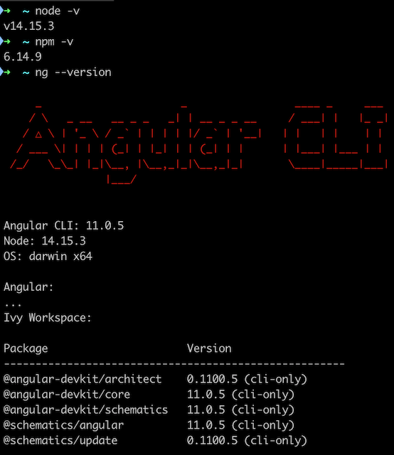

# LeafletNgrxData

This project was generated with [Angular CLI](https://github.com/angular/angular-cli) version 11.0.5.

## Development server

Run `ng serve` for a dev server. Navigate to `http://localhost:4200/`. The app will automatically reload if you change any of the source files.

## Code scaffolding

Run `ng generate component component-name` to generate a new component. You can also use `ng generate directive|pipe|service|class|guard|interface|enum|module`.

## Build

Run `ng build` to build the project. The build artifacts will be stored in the `dist/` directory. Use the `--prod` flag for a production build.

## Running unit tests

Run `ng test` to execute the unit tests via [Karma](https://karma-runner.github.io).

## Running end-to-end tests

Run `ng e2e` to execute the end-to-end tests via [Protractor](http://www.protractortest.org/).

## Further help

To get more help on the Angular CLI use `ng help` or go check out the [Angular CLI Overview and Command Reference](https://angular.io/cli) page.

---

## Steps to set up on your own via the Angular CLI

> This tutorial assumes you already have installed the following...

1. [nodejs](https://nodejs.org/en/)
2. [node packge manager](https://www.npmjs.com/get-npm)
3. [Angular CLI](https://angular.io/cli)

At the time of this writing I am using the following...

1. Node v14.15.3
2. NPM 6.14.9
3. Angular CLI: 11.0.5

    

### Create a new Angular project


> This is one of many ways to display a Leaflet Map in Angular, leverage @types/leaflet, and manage API data state via @ngrx/data.

This tutorial assumes you already have installed the following...

-   [nodejs](https://nodejs.org/en/)
-   [node packge manager](https://www.npmjs.com/get-npm)
-   [Angular CLI](https://angular.io/cli)

At the time of this writing I am using the following...

-   Node v14.15.3
-   NPM 6.14.9
-   Angular CLI: 11.0.5

    

**Note:** I will be using the `$` symbol in command line instructions to denote the beggining of a new command.

---

1. Set up a fake REST API using [JSON Server](https://www.npmjs.com/package/json-server)

    > In this case I have installed json-server globally, but you don't necessarily have to do that.

    > Ultimately, the goal is to rapidly demonstrate proof-of-concept.

    ```text
    $ npm install -g json-server
    $ mkdir fake-api
    ```

2. Create a json file.

    ```text
    $ cd fake-api
    $ touch db.json
    ```

3. Add some fake data as it might be rendered from a database table to an API endpoint.

    > In this example our database table will be `Neighborhoods`

    ```json
    {
        "neighborhoods": [
            {
                "id": 1,
                "name": "Little Bohemia",
                "url": "https://en.wikipedia.org/wiki/Little_Bohemia_(Omaha,_Nebraska)",
                "description": "Tempor officia amet dolore et laboris proident.",
                "imgUrl": "https://upload.wikimedia.org/wikipedia/commons/f/f5/PragueHotelOmaha.JPG",
                "lat": 41.245556,
                "lng": -95.933333
            },
            {
                "id": 2,
                "name": "Dundee",
                "url": "https://en.wikipedia.org/wiki/Dundee%E2%80%93Happy_Hollow_Historic_District",
                "description": "Commodo amet duis occaecat eu do in culpa mollit commodo excepteur aute nostrud ullamco ipsum.",
                "imgUrl": "https://upload.wikimedia.org/wikipedia/commons/thumb/2/22/Dundee_HD_Omaha_NE.JPG/320px-Dundee_HD_Omaha_NE.JPG",
                "lat": 41.265034,
                "lng": -95.99038
            },
            {
                "id": 3,
                "name": "Little Italy",
                "url": "https://en.wikipedia.org/wiki/Little_Italy,_Omaha",
                "description": "Cillum enim officia laboris laborum minim voluptate veniam sit sunt cupidatat consectetur elit.",
                "imgUrl": "https://upload.wikimedia.org/wikipedia/commons/0/09/Joel_N._Cornish_House.jpg",
                "lat": 41.245278,
                "lng": -95.921944
            },
            {
                "id": 4,
                "name": "Benson",
                "url": "https://en.wikipedia.org/wiki/Benson,_Nebraska",
                "description": "Laborum aliqua reprehenderit nostrud ad magna fugiat non sint sint duis.",
                "imgUrl": "https://upload.wikimedia.org/wikipedia/commons/e/ef/Omaha%2C_Nebraska_Maple_Street_N_side_from_60_St-Ave_1.JPG",
                "lat": 41.285,
                "lng": -96.009444
            },
            {
                "id": 5,
                "name": "Field Club",
                "url": "https://en.wikipedia.org/wiki/Field_Club_(Omaha,_Nebraska)",
                "description": "Veniam non quis proident laborum do cupidatat nostrud eu nisi culpa.",
                "imgUrl": "https://upload.wikimedia.org/wikipedia/commons/thumb/a/af/Omaha%2C_Nebraska_Woolworth_Ave_x_36_St_NE_corner.JPG/640px-Omaha%2C_Nebraska_Woolworth_Ave_x_36_St_NE_corner.JPG",
                "lat": 41.245278,
                "lng": -95.963889
            }
        ]
    }
    ```

4. Run the fake-api.

    ```
    $ json-server db.json
    ```

5. Verify JSON Server is working **http://localhost:3000**

    

    

6. Verify the the fake REST API is working by going to **http://localhost:3000/neighborhoods**

    

7. Now that a fake API exists, create a new angular project.

    > This example uses strict type checking, routing (irrelevant for this demo), and SCSS. I also included tests (but tests are also irrelevant for this demo).

    ```
    $ ng new leaflet-ngrx-data
    $ cd leaflet-ngrx-data
    ```

8. Start it up.

    ```
    $ npm run start
    ```

9. Verify the app is working by going to **http://localhost:4200/**
   

10. Generate a model to provide additional type safety.

    ```
    $ mkdir src/app/models
    $ touch src/app/models/neighborhood.ts
    ```

    ```typescript
    // src/app/models/neighborhood.ts
    export interface Neighborhood {
        id: number;
        name: string;
        url: string;
        description: string;
        imgUrl: string;
        lat: number;
        lng: number;
    }
    ```

11. Install packages to implement [NgRx Data](https://ngrx.io/guide/data) to abstract CRUD operations in the app state.

    > Yes, this is overkill, but this tutorial is a demo for NgRx Data.

    ```
    $ ng add @ngrx/data@latest
    $ ng add @ngrx/effects@latest
    $ ng add @ngrx/entity@latest
    $ ng add @ngrx/store@latest
    ```

    > This creates `src/app/entity-metadata.ts` and app level module imports are updated.

    ```typescript
    // src/app/app.module.ts
    @NgModule({
        ...
        imports: [
            ...
            EffectsModule.forRoot([]),
            EntityDataModule.forRoot(entityConfig),
            StoreModule.forRoot({}, {}),
            ...
        ],
        ...
    })
    ```

12. Import `HttpClientModule` to avoid a `NullInjectorError`.

    ```typescript
    // src/app/app.module.ts
    @NgModule({
        ...
        imports: [
            ...
            HttpClientModule,
            ...
        ],
        ...
    })
    ```

13. Generate a neighborhoods-component, list-component, and map-component.

    > Component structure is ultimately up to the architect, this is one way to set it up.

    ```
    $ ng generate component neighborhood
    $ ng generate component list
    $ ng generate component map
    ```

    ```html
    <!-- src/app/app.component.html -->
    <h1>Leaflet / NgRx Data demo</h1>
    <app-neighborhoods></app-neighborhoods>
    ```

    ```html
    <!-- src/app/neighborhoods/neighborhoods.component.html -->
    <div class="neighborhoods-container">
        <div id="neighboods-list" class="neighborhoods-item">
            <app-list></app-list>
        </div>
        <div id="neighboods-map" class="neighborhoods-item">
            <app-map></app-map>
        </div>
    </div>
    ```

    ```css
    /* src/app/neighborhoods/neighborhoods.component.scss */
    .neighborhoods-container {
        display: flex;
        flex-direction: column;
    }

    .neighborhoods-item {
        height: 300px;
    }
    ```

    

14. Setup a service to GET the API data.

    ```
    $ mkdir src/app/services
    $ cd src/app/services
    $ ng generate service neighborhoods
    ```

15. Add a `defaultDataServiceConfig` below the imports.

    > I added a three second delay to demonstrate asyncronous loading.

    ```typescript
    // src/app/app.module.ts
    const defaultDataServiceConfig: DefaultDataServiceConfig = {
        root: "http://localhost:3000/",
        getDelay: 3000,
    };
    ```

16. Set up providers to use the `defaultDataServiceConfig`.

    ```typescript
    // src/app/app.module.ts
    @NgModule({
        ...
        providers: [
            { provide: DefaultDataServiceConfig, useValue: defaultDataServiceConfig },
        ],
        ...
    })
    ```

17. Extent `NeighborhoodsService` to use `serviceElementsFactory` and a `serviceElementsFactory` super call.

    ```typescript
    // src/app/neighborhoods.service.ts
    ...
    export class NeighborhoodsService extendsEntityCollectionServiceBase<Neighborhood> {
        constructor(serviceElementsFactory: EntityCollectionServiceElementsFactory) {
            super('neighborhood', serviceElementsFactory);
        }
    }
    ```

18. Configure our Neighborhoods Component.

    ```typescript
    // src/app/neighborhoods/neighborhoods.component.ts
    export class NeighborhoodsComponent implements OnInit {
        public isLoading$: Observable<boolean>;
        public errors$: Observable<any>;
        public neighborhoods$: Observable<Neighborhood[]>;

        constructor(private neighbohoodsService: NeighborhoodsService) {
            this.isLoading$ = this.neighbohoodsService.loading$;
            this.errors$ = this.neighbohoodsService.errors$;
            this.neighborhoods$ = this.neighbohoodsService.entities$;
        }

        ngOnInit(): void {
            this.getNeighborhoods();
        }

        private getNeighborhoods(): void {
            this.neighbohoodsService.getAll();
        }
    }
    ```

19. Verify we are able to GET and display API data.

    > Pass asyncronous inputs to `app-list`.

    ```html
    <!-- src/app/neighborhoods/neighborhoods.component.html -->
    <div class="neighborhoods-container">
        <div id="neighboods-list" class="neighborhoods-item">
            <app-list
                [isLoading]="isLoading$ | async"
                [errors]="errors$ | async"
                [neighborhoods]="neighborhoods$ | async"
            ></app-list>
        </div>
        <div id="neighboods-map" class="neighborhoods-item">
            <app-map></app-map>
        </div>
    </div>
    ```

    > Receive inputs in `app-list`

    ```typescript
    // src/app/list/list.component.ts
    @Component({
        selector: "app-list",
        templateUrl: "./list.component.html",
        styleUrls: ["./list.component.scss"],
    })
    export class ListComponent {
        @Input() isLoading!: boolean | null;
        @Input() errors!: any | null;
        @Input() neighborhoods!: Neighborhood[] | null;
    }
    ```

    ```html
    <!-- src/app/list/list.component.html -->
    <div *ngIf="isLoading; else elseTemplate">
        <h1>Fetching neighborhoods...</h1>
    </div>

    <pre *ngIf="errors">
        {{ errors}}
    </pre>

    <ng-template #elseTemplate>
        <div class="list-container">
            <div *ngFor="let neighborhood of neighborhoods">
                <p>{{ neighborhood.name }}</p>
                
            </div>
        </div>
    </ng-template>
    ```

    ```css
    /* src/app/list/list.component.scss */
    img {
        height: 100px;
        width: 100px;
    }

    .list-container {
        display: flex;
        flex-direction: row;
        justify-content: space-around;
        flex-wrap: wrap;
    }
    ```

    

20. Install package [leafletjs](https://leafletjs.com/index.html) packages for Angular.

    > We'll be leveraging leaflet types in this demo.

    ```
    $ npm install leaflet
    $ npm install --save-dev @types/leaflet
    ```

21. Set up a basic leaflet map with open street map tile layer.

    ```css
    /* src/styles.scss */
    @import "~leaflet/dist/leaflet.css";
    ```

    ```html
    <!-- src/app/map/map.component.html -->
    <div id="leafletMapId" class="map"></div>
    ```

    ```css
    /* src/app/map/map.component.scss */
    .map {
        height: 100%;
    }
    ```

    ```typescript
    // src/app/map/map.component.ts
    import { AfterViewInit, Component } from "@angular/core";
    import { Map as LeafletMap, TileLayer } from "leaflet";

    @Component({
        selector: "app-map",
        templateUrl: "./map.component.html",
        styleUrls: ["./map.component.scss"],
    })
    export class MapComponent implements AfterViewInit {
        public leafletMap!: LeafletMap;
        private readonly openStreetMapUrl =
            "https://{s}.tile.openstreetmap.org/{z}/{x}/{y}.png";
        private readonly openStreetMapAttribution =
            '&copy; <a href="https://www.openstreetmap.org/copyright">OpenStreetMap</a> contributors';
        public tiles = new TileLayer(this.openStreetMapUrl, {
            attribution: this.openStreetMapAttribution,
        });

        ngAfterViewInit(): void {
            this.createMap();
        }

        private createMap(): void {
            this.leafletMap = new LeafletMap("leafletMapId", {
                center: {
                    lat: 41.2635,
                    lng: -95.9527,
                },
                layers: [this.tiles],
                maxZoom: 17,
                minZoom: 6,
                zoom: 12,
            });
        }
    }
    ```
