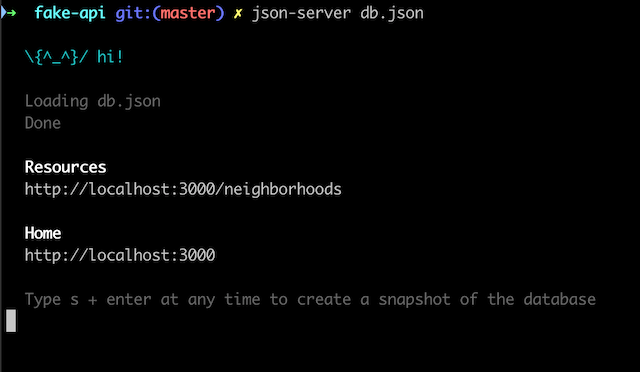

# LeafletNgrxData

This project was generated with [Angular CLI](https://github.com/angular/angular-cli) version 11.0.5.

## Development server

Run `ng serve` for a dev server. Navigate to `http://localhost:4200/`. The app will automatically reload if you change any of the source files.

## Code scaffolding

Run `ng generate component component-name` to generate a new component. You can also use `ng generate directive|pipe|service|class|guard|interface|enum|module`.

## Build

Run `ng build` to build the project. The build artifacts will be stored in the `dist/` directory. Use the `--prod` flag for a production build.

## Running unit tests

Run `ng test` to execute the unit tests via [Karma](https://karma-runner.github.io).

## Running end-to-end tests

Run `ng e2e` to execute the end-to-end tests via [Protractor](http://www.protractortest.org/).

## Further help

To get more help on the Angular CLI use `ng help` or go check out the [Angular CLI Overview and Command Reference](https://angular.io/cli) page.

---

## Steps to set up on your own via the Angular CLI

> This tutorial assumes you already have installed the following...

1. [nodejs](https://nodejs.org/en/)
2. [node packge manager](https://www.npmjs.com/get-npm)
3. [Angular CLI](https://angular.io/cli)

At the time of this writing I am using the following...

1. Node v14.15.3
2. NPM 6.14.9
3. Angular CLI: 11.0.5
   

### Create a new Angular project

1. Create new angular project. (I chose strict type checking, add routing, and SCSS)

```
$ ng new leaflet-ngrx-data
$ cd leaflet-ngrx-data
```

2. Start it up.

```
$ npm run start
```

3. Verify it is working by going to http://localhost:4200/
   

### Set up a fake REST API

1. Install [JSON Server](https://www.npmjs.com/package/json-server).
   > In this case I have installed json-server globally, but you don't necessarily have to do that.
   > Since this repo is not meant for production, I have included the fake-api in the repo.
   > Ultimately, the goal is to rapidly demonstrate proof-of-concept.

```
$ npm install -g json-server
$ mkdir fake-api
```

2. Create a json file.

```
$ cd fake-api
$ touch db.json
```

3. Add some fake data.
<!-- TODO: c/p the final db.json here -->
4. Run the fake-api

```
$ json-server db.json
```

5. Verify JSON Server is working http://localhost:3000
   
   
6. Verify the the fake REST API is working by going to http://localhost:3000/neighborhoods
   <!-- TODO: add image of API endpoint when this demo works-->
   <!--  -->

### Integrate the API with a Leaflet Map.

1. Model the data structure for additional type safety.

```
$ mkdir src/app/models
$ touch src/app/models/neighborhood.ts
```

```typescript
// TODO: add final interface here
```

2. Install packages to implement [NgRx Data](https://ngrx.io/guide/data) to abstract CRUD operations in the app state.
   > Yes, this is overkill, but this tutorial is a demo for NgRx Data.

```
$ ng add @ngrx/data@latest
$ ng add @ngrx/effects@latest
$ ng add @ngrx/entity@latest
$ ng add @ngrx/store@latest
```

- _Note 1_: Notice this creates `src/app/entity-metadata.ts`
- _Note 2_: `src/app/app.module.ts` imports are updated...

```typescript
@NgModule({
    ...
    imports: [
        ...
        EffectsModule.forRoot([]),
        EntityDataModule.forRoot(entityConfig),
        StoreModule.forRoot({}, {}),
        ...
    ],
    ...
})
```

3. Add `HttpClientModule` to `src/app/app.module.ts` imports to avoid a `NullInjectorError`.

```typescript
@NgModule({
    ...
    imports: [
        ...
        HttpClientModule,
        ...
    ],
    ...
})
```

4. Generate a component to display our map.

```
$ ng generate component map
CREATE src/app/map/map.component.scss (0 bytes)
CREATE src/app/map/map.component.html (18 bytes)
CREATE src/app/map/map.component.spec.ts (605 bytes)
CREATE src/app/map/map.component.ts (264 bytes)
UPDATE src/app/app.module.ts (837 bytes)
```

```html
<!-- src/app/app.component.html -->
<h1>Leaflet / NgRx Data demo</h1>
<app-map></app-map>
```

 5. Setup a service to GET the API data.

```
$ ng generate service neighborhoods
CREATE src/app/neighborhoods.service.spec.ts (392 bytes)
CREATE src/app/neighborhoods.service.ts (142 bytes)
```

6. Add a `defaultDataServiceConfig` below the imports.

```typescript
// src/app/app.module.ts
const defaultDataServiceConfig: DefaultDataServiceConfig = {
  root: "http://localhost:3000/",
};
```

7. Set up providers for the to use the `defaultDataServiceConfig`.

```typescript
// src/app/app.module.ts
@NgModule({
    ...
    providers: [
        { provide: DefaultDataServiceConfig, useValue: defaultDataServiceConfig },
    ],
    ...
})
```

8. Extent `NeighborhoodsService` to use `serviceElementsFactory` and a `serviceElementsFactory` super call.

```typescript
// src/app/neighborhoods.service.ts
...
export class NeighborhoodsService extends EntityCollectionServiceBase<Neighborhood> {
    constructor(serviceElementsFactory: EntityCollectionServiceElementsFactory) {
        super('Neighborhood', serviceElementsFactory);
  }
}
```

9. Configure our Map Component to tell the Neighborhoods service to get the neighborhoods list and observe the neighborhoods list.

```typescript
// src/app/map/map.component.ts
export class MapComponent implements AfterViewInit {
    ...
    public isLoading$: Observable<boolean>;
    public errors$: Observable<any>;
    public neighborhoods$: Observable<Neighborhood[]>;

    constructor(private neighbohoodsService: NeighborhoodsService ) {
        this.isLoading$ = this.neighbohoodsService.loading$;
        this.errors$ = this.neighbohoodsService.errors$;
        this.neighborhoods$ = this.neighbohoodsService.getAll();
    }
    ...
}
```

10. Verify we can GET API data.

```css
/* src/app/map/map.component.scss */
img {
  height: 100px;
  width: 100px;
}
```

```html
<!-- src/app/map/map.component.html -->
<div *ngIf="isLoading$ | async; else elseTemplate">
  <h1>Fetching neighborhoods...</h1>
</div>

<pre *ngIf="errors$ | async">
    {{ errors$ | async | json }}
</pre>

<ng-template #elseTemplate>
  <!-- <pre>{{ neighborhoods$ | async | json }}</pre> -->
  <div *ngFor="let neighborhood of (neighborhoods$ | async)">
    <h3>{{ neighborhood.name }}</h3>
    
  </div>
</ng-template>
```


11. Implement [leafletjs](https://leafletjs.com/index.html) for Angular.
12. Plot the markers with popups.
